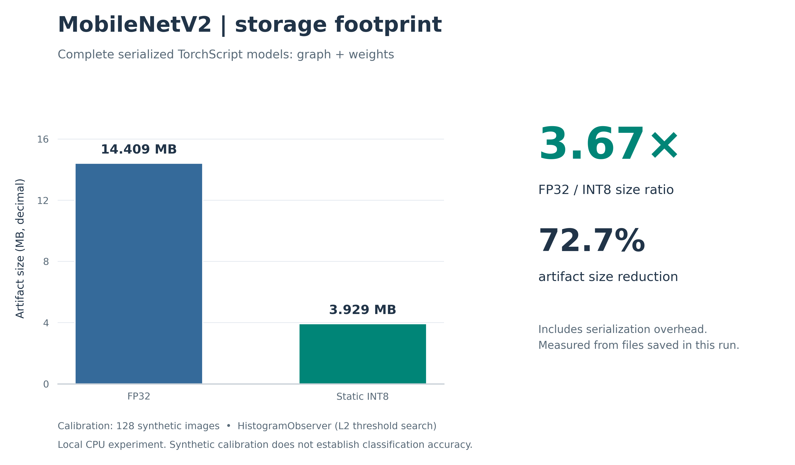
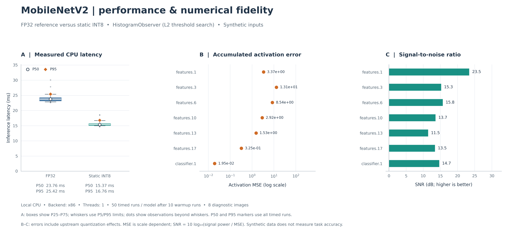

# MobileNetV2 FP32 to static INT8

Phases 2 and 3 of the supplied TinyML roadmap: a pretrained CPU FP32 baseline,
deterministic synthetic calibration, eager static INT8 PTQ, and measured model
artifact size and CPU latency. The research diagnostics add configurable histogram
calibration, layer-wise activation MSE/NMSE/SNR, and publication-style figures.
This implements the requested `torch.ao.quantization`
API using a pinned compatible PyTorch/torchvision pair.
PyTorch 2.8 emits deprecation warnings for this legacy API; the requested eager
implementation is intentionally pinned rather than relying on future API availability.

## Visual results

The figures below are generated by `python main.py` from that run's saved
measurements. They describe this CPU and synthetic-data configuration; they
are not ImageNet accuracy or edge-device benchmarks.





See [`artifacts/metrics.json`](artifacts/metrics.json) for the exact configuration,
raw latency samples and numerical diagnostics. PNG/SVG figures and this metrics
file can be versioned; large model binaries, virtual environments and caches
remain ignored.

## Run

Python 3.12 was used for validation. From this project directory on Windows:

```powershell
python -m venv .venv
.\.venv\Scripts\python.exe -m pip install --index-url https://download.pytorch.org/whl/cpu torch==2.8.0 torchvision==0.23.0
.\.venv\Scripts\python.exe -m pip install -r requirements.txt
.\.venv\Scripts\python.exe main.py
```

The environment is already installed in this workspace. To run the exact
`python main.py` command without activating a PowerShell script:

```powershell
$env:PATH = "$PWD\.venv\Scripts;$env:PATH"
python main.py
```

The first run downloads the official pretrained ImageNet weights into
`.cache/torch/checkpoints/`. Subsequent runs use the cache. No images or datasets
are downloaded, and the pipeline never substitutes random weights if loading
the pretrained checkpoint fails.

Defaults: 128 synthetic images, calibration batch size 8, seed 42, one CPU
intra-op thread, one inter-op thread, benchmark batch size 1, 10 warmups, and
50 timed inferences for each model. Histogram activation calibration uses 2,048
bins by default; layer diagnostics use eight separate synthetic images.
Available options:

```powershell
python main.py --help
python main.py --calibration-samples 256 --iterations 100 --threads 2
python main.py --calibration-method histogram --histogram-bins 2048 --evaluation-samples 16
python main.py --calibration-method minmax --output-dir artifacts/minmax
```

## Modules

| File | Responsibility |
| --- | --- |
| `model_loader.py` | Load torchvision's quantization-ready MobileNetV2 with `IMAGENET1K_V2` FP32 weights. |
| `calibration_dataloader.py` | Generate per-index deterministic 3x224x224 RGB noise, normalized with ImageNet mean/std. |
| `ptq_quantizer.py` | Copy/fuse/prepare/calibrate/convert and inspect INT8 layers. |
| `profiler.py` | Save full TorchScript models, verify reloads, measure artifact sizes and eager CPU latency. |
| `evaluator.py` | Compare aligned FP32/INT8 block activations with temporary forward hooks. |
| `visualizer.py` | Generate 300-dpi PNG figures and SVG companions with matplotlib/seaborn. |
| `main.py` | Execute the pipeline, check actual quantized operator execution, print and save metrics. |

Both models start with the same torchvision quantizable architecture, which
replaces ReLU6 with ReLU and uses quantization-compatible residual additions.
With `quantize=False`, the baseline remains FP32. It is not the unmodified
ReLU6 architecture returned by the ordinary torchvision MobileNetV2 factory.
Using the same adaptation in both models holds that change fixed in the comparison.

The quantizer preserves the unfused FP32 baseline and fuses the INT8 copy's
Conv-BatchNorm-ReLU and Conv-BatchNorm blocks. It uses configurable
`HistogramObserver` (default) or `MinMaxObserver` for per-tensor affine
activations and `PerChannelMinMaxObserver` for symmetric
signed weights on x86/FBGEMM/oneDNN. QNNPACK uses per-tensor signed weights.
Activations use unsigned 8-bit storage; x86/FBGEMM calibration uses 0..127 to
match their reduced-range policy. Other supported backends use 0..255.
All convolution and linear weights must convert to `qint8`, and actual
quantized convolution and linear kernels must execute before results are accepted.

**Histogram calibration is not KL calibration.** The pinned PyTorch
[`HistogramObserver` implementation](https://github.com/pytorch/pytorch/blob/v2.8.0/torch/ao/quantization/observer.py)
uses an approximate L2 quantization-error minimization to select the clipping
range. It tracks activation distributions and trades clipping against rounding
error. MinMax uses observed extrema. A histogram does not imply an entropy/KL
objective, and no improvement in accuracy is assumed for either method.
The method, bin count, threshold objective and calibration duration are saved
in each run's metrics. Weight observers remain the same between methods.

## Layer-wise diagnostics

Forward hooks capture corresponding logical block outputs at `features.1`,
`features.3`, `features.6`, `features.10`, `features.13`, `features.17`, and
`classifier.1`. These module boundaries survive fusion and conversion.
INT8 activations are dequantized before comparison, and captured tensors are
cloned so later in-place operations cannot change the reference. Hook handles
are removed in `finally`, before profiling and TorchScript serialization.

For reference activations `x` and dequantized INT8 activations `q`, the evaluator
accumulates sums in float64 across every element of all evaluation samples:

- `MSE = sum((x - q)^2) / N`.
- `signal_power = sum(x^2) / N`.
- `NMSE = sum((x - q)^2) / sum(x^2)`.
- `SNR_dB = 10 * log10(sum(x^2) / sum((x - q)^2))`.

Zero signal/noise cases receive explicit status labels and JSON `null` for
undefined or infinite values. No epsilon is inserted into the measurements.
Calibration, the benchmark input, and diagnostic samples use disjoint seed
intervals. Samples are processed sequentially, so the evaluator need not store
activations for the whole dataset.

An output's error includes upstream quantization effects. Low SNR identifies
a point worth investigating; it does not establish that the sampled block
alone caused the error. Raw MSE is scale-dependent, so NMSE and SNR are recorded
alongside it. These measurements remain synthetic-data diagnostics.

## Artifacts and measurement

Each run writes:

- `artifacts/mobilenet_v2_fp32.pt`: full FP32 TorchScript graph and weights.
- `artifacts/mobilenet_v2_int8.pt`: full INT8 TorchScript graph and weights.
- `artifacts/metrics.json`: environment, configuration, quantization coverage,
  byte counts, raw latency samples, statistics, throughput, compression,
  speedup and layer-wise MSE/NMSE/SNR.
- `artifacts/artifact_size.png`: FP32/INT8 serialized-size comparison.
- `artifacts/latency_and_layerwise_error.png`: latency distributions and
  layer-wise quantization diagnostics.
- SVG companions for both figures, suitable for resizing in a paper or presentation.

Figures use matplotlib's headless Agg backend; no desktop display is required.
Plots carry the calibration method and synthetic-data context. Plotting occurs
after inference timing. The machine-readable JSON stores the figure paths.

Sizes use decimal MB (1,000,000 bytes), including graph/quantization metadata.
Both saved models are reloaded and their outputs checked against eager execution.
Latency uses `time.perf_counter_ns()` under inference mode with the same fixed,
preprocessed input and thread count. Serialization, input generation, kernel
inspection, reload verification and warmups are excluded. P50, P95, mean and
standard deviation are recorded. Speedup is FP32 P50 divided by INT8 P50.
Measurements run FP32 first, then INT8; the order is recorded. CPU load and
power/thermal conditions are not controlled, so timings can vary between runs.

Reload a saved model with the backend recorded in its metrics:

```python
import torch

torch.backends.quantized.engine = "x86"  # use the recorded, locally supported backend
model = torch.jit.load("artifacts/mobilenet_v2_int8.pt", map_location="cpu").eval()
```

Synthetic noise exercises calibration and conversion but does not establish
ImageNet accuracy or suitability for deployment. The printed output NMSE uses
one separate synthetic input; it is not a classification-accuracy measurement.
These CPU timings and serialized artifact sizes do not measure peak RAM, energy,
NPU acceleration, or performance on an edge device.

## Checks

```powershell
.\.venv\Scripts\python.exe -m unittest discover -v
```

Checks cover deterministic data independent of the global RNG, partial calibration
batches, the explicit min/max and histogram policies, FP32 model preservation,
complete INT8 conversion, finite classifier outputs, diagnostic arithmetic,
quantized-activation dequantization, and hook cleanup on success and failure.
The conversion test uses random
weights only to remain offline; `main.py` always uses pretrained weights and
additionally verifies serialized-model round trips and quantized kernel execution.

API references: [torchvision 0.23 MobileNetV2 quantization implementation](https://github.com/pytorch/vision/blob/v0.23.0/torchvision/models/quantization/mobilenetv2.py)
and [official PyTorch version combinations](https://pytorch.org/get-started/previous-versions/).
